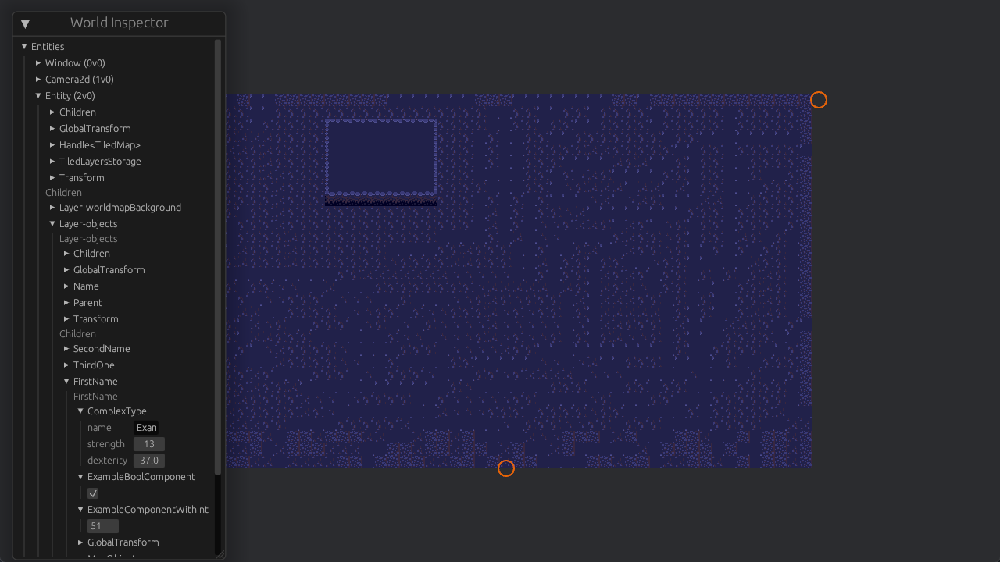
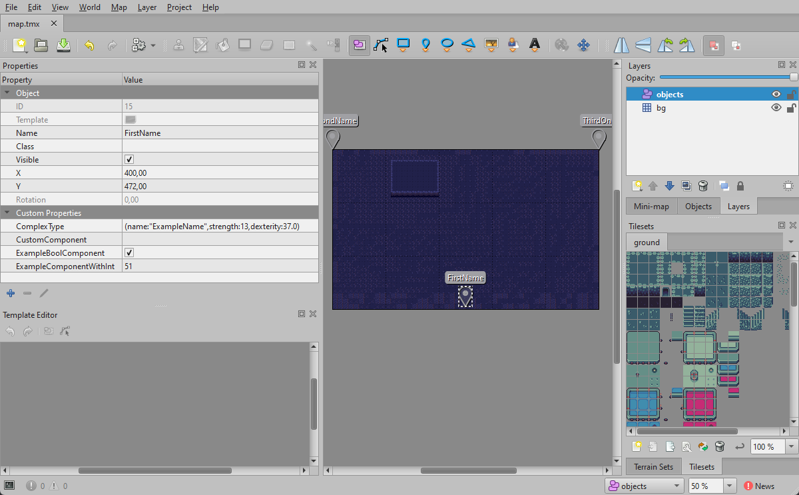

# Bevy Tiled Blueprints

Ability to read properties from Tiled maps objects straight into Bevy Engine.


## Install

> I am waiting with release on crates.io until [this PR](https://github.com/StarArawn/bevy_ecs_tilemap/pull/489) gets merged so Cargo.toml can have dependency on specific version from crates.io instead of git branch from other repo. 

```
cargo add bevy_tiled_blueprints --git "https://github.com/Leinnan/bevy_tiled_blueprints"
```





## Usage

| Tiled | Bevy |
|-----|----|
| Object | Entity |
| object.name | Name component |
| Custom property | Component |
| Custom property name | Component struct name |
| Custom property value | Component serialized in ron format |

Supported custom property values:
- empty for unit-like structs without any fields
- int/bool/float for tuple structs with one unnamed fields
- [ron](https://github.com/ron-rs/ron) strings for regular structs
- string properties for enum components
- string properties with names with prefixes `remove:` like `remove:{NameOfComponent}` for removing components.

Custom properties added to the layer or the map itself would be added in the same way to the corresponding entities.

## Usage

Debug rendering of Objects placement can be enabled by adding `TiledBlueprintsDebugDisplayPlugin` plugin to the application.
There is example in `examples/simple.rs`. 

## ToDo

- parse different object shapes, for now it just takes `x` and `y` pos and turns that into `Tranform` components
- make example with support for collisions from `bevy_rapier` for example
- update `Cargo.toml` so it use package from crates.io instead of github branch- blocked until [bevy_ecs_tilemap](https://github.com/StarArawn/bevy_ecs_tilemap) gets update
- create workflow for using [Custom enums and classes](https://doc.mapeditor.org/en/stable/manual/custom-properties/#custom-classes) from Tiled. 
Best case scenario- with provided relative path to Tiled project file on game build bevy feeds data about custom properties to project file.
- support for object and file property values.

---

Big thanks to the authors of [bevy_ecs_tilemap](https://github.com/StarArawn/bevy_ecs_tilemap), this whole thing is based on expanding the tiled example from there.
Same thanks to the authors of [Blender_bevy_components_workflow](https://github.com/kaosat-dev/Blender_bevy_components_workflow).

---

Web example has issues with rendering but if you look into console you can see it works.

## Contributing

Got some idea, feedback, question or found any bug? Feel free to open an issue at any time!
